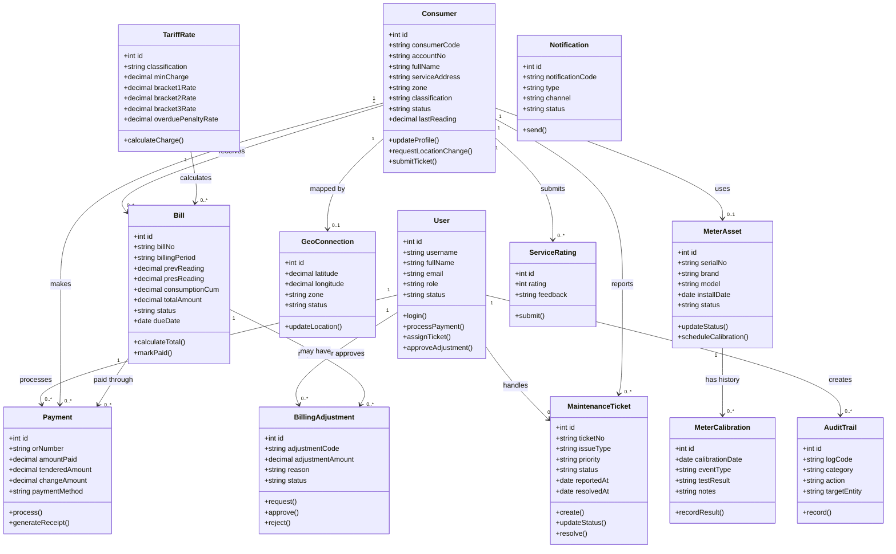

# Lambawasa Utility Management System
## Class Diagram Guide

This guide is based on the current React frontend, PHP API, and MySQL schema in this project.

The recommended diagram is a **domain class diagram**. It focuses on the real business objects stored in the database and the relationships between them. React components and PHP endpoints are shown separately as system layers because they are controllers/services, not the main business entities.

## 1. Main Classes to Draw

### User
Represents administrators, cashiers, technicians, billing officers, the president, office staff, and field staff.

Important attributes:
- id
- username
- fullName
- email
- role
- status

Important responsibilities:
- authenticate in the system
- process payments when acting as a cashier
- handle maintenance tickets when acting as a technician
- approve billing adjustments when authorized
- create audit records

### Consumer
Represents a household, commercial account, or institutional account connected to the water utility.

Important attributes:
- id
- consumerCode
- accountNo
- fullName
- contactNo
- serviceAddress
- zone
- classification
- meterSerial
- status
- approvalStatus
- connectionDate
- lastReading

Important responsibilities:
- maintain account and service information
- own a water meter
- receive bills and notifications
- submit service concerns

### MeterAsset
Represents the physical water meter installed at a consumer location.

Important attributes:
- id
- serialNo
- brand
- model
- pipeSize
- installDate
- consumerId
- zone
- lastCalibration
- nextCalibration
- status

Important responsibilities:
- record meter assignment and condition
- track calibration status
- store maintenance history

### MeterCalibration
Represents one calibration, laboratory test, or meter repair event.

Important attributes:
- id
- meterId
- calibrationDate
- eventType
- technicianName
- accuracyMargin
- testResult
- notes

### GeoConnection
Represents the map location of a consumer connection.

Important attributes:
- id
- consumerId
- zone
- latitude
- longitude
- status

### TariffRate
Represents the water rate rules used to calculate a bill.

Important attributes:
- id
- classification
- minCharge
- minCum
- bracket1Rate
- bracket2Rate
- bracket3Rate
- environmentalFeeRate
- meterMaintenanceFee
- overduePenaltyRate
- isActive

### Bill
Represents a billing statement for a consumer and billing period.

Important attributes:
- id
- billNo
- consumerId
- billingPeriod
- prevReading
- presReading
- consumptionCum
- baseAmount
- envFee
- maintFee
- arrears
- penalty
- totalAmount
- status
- dueDate
- paidDate

Important responsibilities:
- calculate the amount due from consumption and tariff rules
- track overdue, paid, ready, or disputed status
- provide the bill reference for payments and adjustments

### Payment
Represents a payment transaction and official receipt.

Important attributes:
- id
- orNumber
- billId
- consumerId
- cashierId
- amountPaid
- tenderedAmount
- changeAmount
- paymentMethod
- paymentDate

### MaintenanceTicket
Represents a consumer service request or field work order.

Important attributes:
- id
- ticketNo
- consumerId
- zone
- issueType
- priority
- status
- assignedTechnicianId
- reportedAt
- resolvedAt
- description
- resolutionNotes

### Notification
Represents a billing notice, payment reminder, overdue notice, or service alert.

Important attributes:
- id
- notificationCode
- type
- recipientName
- accountNo
- message
- channel
- status
- sentAt

### AuditTrail
Represents an immutable record of an important system action.

Important attributes:
- id
- logCode
- userId
- userName
- userRole
- category
- action
- targetEntity
- details
- ipAddress
- createdAt

### BillingAdjustment
Represents a request to change a bill and the approval decision.

Important attributes:
- id
- adjustmentCode
- billId
- accountNo
- reason
- adjustmentAmount
- requestedBy
- approvedBy
- status
- createdAt
- updatedAt

### ServiceRating
Represents consumer feedback after a service ticket is resolved.

Important attributes:
- id
- ticketNo
- consumerId
- consumerName
- rating
- feedback
- createdAt

## 2. Ready-to-Use Mermaid Diagram

Paste this into a Mermaid-compatible Markdown viewer. The diagram uses the database foreign keys and the application domain relationships.



## 3. Relationship Meaning

Use these multiplicities when drawing the diagram:

| Relationship | Meaning |
|---|---|
| Consumer 1 to many Bill | One consumer can receive many billing statements over time. |
| Consumer 1 to many Payment | One consumer can make many payments. |
| Consumer 1 to many MaintenanceTicket | One consumer can report many problems. |
| Consumer 1 to zero or one MeterAsset | A consumer may have no meter yet or one assigned meter. |
| MeterAsset 1 to many MeterCalibration | One meter can have many calibration records. |
| Bill 1 to many Payment | A bill can be paid through one or more recorded transactions. |
| Bill 1 to many BillingAdjustment | A bill can have adjustment requests or approval records. |
| User 1 to many Payment | A cashier can process many payments. |
| User 1 to many MaintenanceTicket | A technician can be assigned many tickets. |
| User 1 to many AuditTrail | A user's actions can create many audit entries. |
| TariffRate 1 to many Bill | A tariff classification is used to calculate many bills. |

## 4. Application Layer Classes

These are the important frontend and backend classes/modules that operate on the domain classes:

| Layer | Existing project class/module | Main purpose |
|---|---|---|
| Frontend controller | `App` in `src/App.jsx` | Holds application state, navigation, login state, and data synchronization. |
| Frontend view | `OverviewDashboard` | Displays summary statistics and role-specific overview actions. |
| Frontend view | `HouseholdProfiling` | Creates, edits, and approves consumer records. |
| Frontend view | `MeterAssetLogging` | Manages meter assets and calibration history. |
| Frontend view | `GeographicalMapping` | Displays and updates mapped consumer locations. |
| Frontend service | `api` in `src/services/api.js` | Sends HTTP requests to the PHP API. |
| Backend service | `auth.php` | Handles login and authentication-related requests. |
| Backend service | `consumers.php` | Handles consumer creation and approval operations. |
| Backend service | `bills.php` | Handles single and batch bill creation. |
| Backend service | `payments.php` | Handles payment processing. |
| Backend service | `tickets.php` | Handles service ticket creation and updates. |
| Backend service | `meters.php` | Handles meter creation and updates. |
| Backend service | `audit.php` | Records operational audit actions. |
| Backend service | `notifications.php` | Creates and sends notification records. |

In a larger architecture diagram, connect the layers like this:

```text
React components -> App state/navigation -> api service -> PHP endpoints -> MySQL classes/tables
```

## 5. How to Present the Diagram

Use this short explanation in class:

> The Lambawasa Utility Management System is organized around the Consumer and User classes. A Consumer is connected to a meter, receives bills, makes payments, reports maintenance tickets, and may have a mapped location. A Bill is calculated using a TariffRate and can be paid through Payment transactions or changed through BillingAdjustment requests. Users operate the system according to their roles: cashiers process payments, technicians handle service tickets, and authorized users approve adjustments. AuditTrail and Notification record system activities and communication for accountability.

## 6. Drawing Tips

1. Put `Consumer`, `Bill`, and `User` near the center because most workflows connect to them.
2. Place `MeterAsset`, `MeterCalibration`, and `GeoConnection` around `Consumer`.
3. Place `Payment` and `BillingAdjustment` around `Bill`.
4. Place `MaintenanceTicket` and `ServiceRating` below `Consumer`.
5. Place `AuditTrail` and `Notification` at the side as supporting system classes.
6. Use solid association lines for normal relationships.
7. Use `1`, `0..1`, and `0..*` multiplicities beside the relationship ends.
8. Do not draw every React component as a database class. Show React components and PHP files as an application layer only when your instructor asks for architecture as well as domain classes.

## 7. Source Files Used

- `database/schema.sql`
- `my-react-app/src/App.jsx`
- `my-react-app/src/services/api.js`
- `my-react-app/src/components/OverviewDashboard.jsx`
- `my-react-app/src/components/HouseholdProfiling.jsx`
- `my-react-app/src/components/MeterAssetLogging.jsx`
- `my-react-app/src/components/PaymentPOS.jsx`
- `my-react-app/src/components/MaintenanceComplaintLog.jsx`
- `my-react-app/src/components/ReportsModule.jsx`
