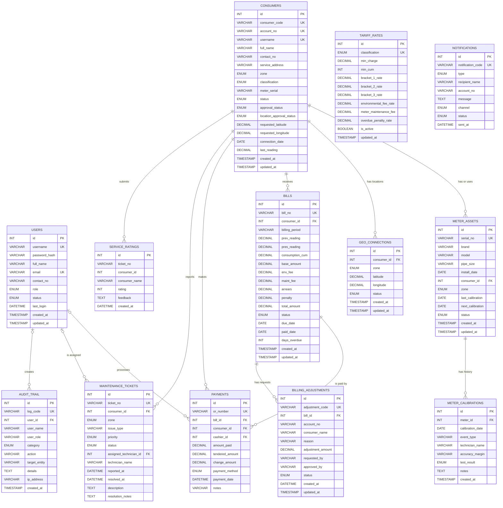

# Lambawasa Utility Management System
## Complete ERD Guide

This document describes the complete Entity-Relationship Diagram (ERD) for the application database `waterline_db`.

The ERD is based on:

- `database/schema.sql`
- `database/migration_centralized_consumers.sql`
- `database/migration_consumer_location_approval.sql`
- `database/migration_ticket_pending_status.sql`
- React data and API workflows in `my-react-app/src/`

The database contains 13 tables. The application manages users, consumers, water meters, geographic locations, tariffs, billing, payments, service tickets, notifications, audit logs, billing adjustments, and service feedback.

## 1. Complete Mermaid ERD

Copy this code into a Mermaid-compatible Markdown editor or Mermaid Live Editor.



## 2. ERD Symbols

| Symbol | Meaning |
|---|---|
| `PK` | Primary key. Uniquely identifies each row. |
| `FK` | Foreign key. References a primary key in another table. |
| `UK` | Unique key. Duplicate values are not allowed. |
| `||` | Exactly one. |
| `o|` | Zero or one. |
| `o{` | Zero or many. |
| `\|{` | One or many. |

For example:

```text
CONSUMERS ||--o{ BILLS
```

means one consumer may have zero or many bills, while each bill belongs to one consumer.

## 3. Table-by-Table Explanation

### USERS
Stores system accounts and role information.

Primary key:
- `id`

Unique fields:
- `username`
- `email`

Used by:
- `payments.cashier_id`
- `maintenance_tickets.assigned_technician_id`
- `audit_trail.user_id`

Main roles include Administrator, Cashier, Technician, Billing Officer, President, Office Staffs, and Field Staffs.

### CONSUMERS
Stores water utility customers and their service accounts.

Primary key:
- `id`

Unique fields:
- `consumer_code`
- `account_no`
- `username`, when provided

Referenced by:
- `meter_assets.consumer_id`
- `geo_connections.consumer_id`
- `bills.consumer_id`
- `payments.consumer_id`
- `maintenance_tickets.consumer_id`
- `service_ratings.consumer_id`

The approval fields were added by migrations. `location_approval_status`, `requested_latitude`, and `requested_longitude` support location-change requests before approval.

### METER_ASSETS
Stores the physical meter installed for a service connection.

Primary key:
- `id`

Foreign key:
- `consumer_id -> consumers.id`

Delete behavior:
- If a consumer is deleted, the meter remains but `consumer_id` becomes `NULL` because of `ON DELETE SET NULL`.

### METER_CALIBRATIONS
Stores calibration, testing, and repair history for meters.

Primary key:
- `id`

Foreign key:
- `meter_id -> meter_assets.id`

Delete behavior:
- Calibration records are deleted when their meter is deleted because of `ON DELETE CASCADE`.

### GEO_CONNECTIONS
Stores map coordinates for consumer connections.

Primary key:
- `id`

Foreign key:
- `consumer_id -> consumers.id`

Delete behavior:
- A consumer deletion cascades to the related geographic connection.

### TARIFF_RATES
Stores the rate brackets used by the consumption calculator.

Primary key:
- `id`

Unique field:
- `classification`

Important note:
- The current schema does not declare a foreign key from `bills` to `tariff_rates`.
- The relationship is a logical application relationship: a bill is calculated using the tariff rate matching the consumer classification.

### BILLS
Stores billing statements and calculated charges.

Primary key:
- `id`

Unique field:
- `bill_no`

Foreign key:
- `consumer_id -> consumers.id`

Delete behavior:
- Bills are deleted when their consumer is deleted because of `ON DELETE CASCADE`.

A bill contains readings, consumption, base charges, environmental fees, maintenance fees, arrears, penalties, total amount, due date, and payment status.

### PAYMENTS
Stores official receipt transactions.

Primary key:
- `id`

Unique field:
- `or_number`

Foreign keys:
- `bill_id -> bills.id`
- `consumer_id -> consumers.id`
- `cashier_id -> users.id`

Delete behavior:
- A bill or consumer cannot be deleted if payments depend on it because the bill and consumer relationships use `ON DELETE RESTRICT`.
- If the cashier user is deleted, `cashier_id` becomes `NULL` because of `ON DELETE SET NULL`.

### MAINTENANCE_TICKETS
Stores consumer complaints and field work orders.

Primary key:
- `id`

Foreign keys:
- `consumer_id -> consumers.id`
- `assigned_technician_id -> users.id`

Delete behavior:
- Tickets are deleted when their consumer is deleted because of `ON DELETE CASCADE`.
- If the assigned technician is deleted, the assignment becomes `NULL`.

The ticket status supports Reported, Pending, Dispatched, In Progress, and Resolved.

### AUDIT_TRAIL
Stores accountability logs for important system operations.

Primary key:
- `id`

Unique field:
- `log_code`

Foreign key:
- `user_id -> users.id`

Delete behavior:
- Audit records remain if a user is deleted; only `user_id` becomes `NULL`.
- This preserves the historical log through the denormalized `user_name` and `user_role` fields.

### NOTIFICATIONS
Stores automated and manual notices.

Primary key:
- `id`

Unique field:
- `notification_code`

Important note:
- `account_no` logically identifies a consumer account, but the current schema does not declare `notifications.account_no` as a foreign key to `consumers.account_no`.
- Draw this as a dashed or labelled logical relationship only if your instructor wants non-FK business relationships shown.

### BILLING_ADJUSTMENTS
Stores requests to change bill amounts and the approval result.

Primary key:
- `id`

Unique field:
- `adjustment_code`

Foreign key:
- `bill_id -> bills.id`

Delete behavior:
- Adjustments are deleted when their bill is deleted because of `ON DELETE CASCADE`.

The request and approval users are stored as names in `requested_by` and `approved_by`; they are not foreign keys to `users` in the current schema.

### SERVICE_RATINGS
Stores consumer feedback about resolved service tickets.

Primary key:
- `id`

Indexed fields:
- `ticket_no`
- `consumer_id`

Important note:
- `consumer_id` is indexed but is not declared as a foreign key.
- `ticket_no` is also indexed through `idx_ratings_ticket` but is not declared as a foreign key to `maintenance_tickets.ticket_no`.
- These are logical relationships in the application, not enforced database relationships.

## 4. Foreign Key List

| Constraint | Child table and column | Parent table and column | Delete behavior |
|---|---|---|---|
| `fk_meters_consumer` | `meter_assets.consumer_id` | `consumers.id` | Set NULL |
| `fk_calibrations_meter` | `meter_calibrations.meter_id` | `meter_assets.id` | Cascade |
| `fk_geo_consumer` | `geo_connections.consumer_id` | `consumers.id` | Cascade |
| `fk_bills_consumer` | `bills.consumer_id` | `consumers.id` | Cascade |
| `fk_payments_bill` | `payments.bill_id` | `bills.id` | Restrict |
| `fk_payments_consumer` | `payments.consumer_id` | `consumers.id` | Restrict |
| `fk_payments_cashier` | `payments.cashier_id` | `users.id` | Set NULL |
| `fk_tickets_consumer` | `maintenance_tickets.consumer_id` | `consumers.id` | Cascade |
| `fk_tickets_tech` | `maintenance_tickets.assigned_technician_id` | `users.id` | Set NULL |
| `fk_audit_user` | `audit_trail.user_id` | `users.id` | Set NULL |
| `fk_adj_bill` | `billing_adjustments.bill_id` | `bills.id` | Cascade |

## 5. Logical Relationships Without Foreign Keys

These relationships are visible in the application but are not enforced with SQL foreign-key constraints:

| Source | Logical target | Reason |
|---|---|---|
| `consumers.meter_serial` | `meter_assets.serial_no` | Consumer records keep a meter serial reference, while the enforced relationship is `meter_assets.consumer_id`. |
| `tariff_rates.classification` | `consumers.classification` and bill calculation | The calculator selects rates by classification. |
| `notifications.account_no` | `consumers.account_no` | Notifications identify the recipient account by account number. |
| `billing_adjustments.account_no` | `consumers.account_no` | Adjustment records keep a denormalized account number. |
| `billing_adjustments.requested_by` | `users.full_name` | Requester is stored as a name rather than a user ID. |
| `billing_adjustments.approved_by` | `users.full_name` | Approver is stored as a name rather than a user ID. |
| `service_ratings.ticket_no` | `maintenance_tickets.ticket_no` | Feedback references the ticket number without an FK. |
| `service_ratings.consumer_id` | `consumers.id` | Consumer ID is indexed but lacks an FK constraint. |

## 6. Suggested ERD Layout

For a clean hand-drawn or presentation diagram, use this arrangement:

```text
                         USERS
                    /      |       \
                   /       |        \
              PAYMENTS  AUDIT    TICKETS
                 |                  |
              BILLS <-------- CONSUMERS -------- GEO_CONNECTIONS
                |                 |  \
       BILLING_ADJUSTMENTS        |   METER_ASSETS
                                  |        |
                           SERVICE_RATINGS  METER_CALIBRATIONS

                 TARIFF_RATES -> used to calculate BILLS
                 NOTIFICATIONS -> logically addressed by CONSUMERS
```

Put `CONSUMERS` in the center because it is the main account entity. Put `BILLS` between consumers and payments because billing is the financial hub. Put `USERS` above the operational tables because users perform or authorize system actions.

## 7. Database Workflow Summary

### Consumer registration

1. A user creates a consumer record.
2. The consumer may be approved or rejected.
3. A meter can be assigned to the consumer.
4. A geographic connection can be recorded or approved.

### Billing

1. The system reads the consumer's previous and present meter readings.
2. Consumption is calculated.
3. The matching tariff classification is used by the application calculator.
4. A bill is created with fees, arrears, penalties, and total amount.
5. The system may create a notification for the account.

### Payment

1. A cashier selects a consumer bill.
2. A payment is recorded with an official receipt number.
3. The payment references both the bill and consumer.
4. The bill can be marked as paid.
5. The action can be recorded in the audit trail.

### Service request

1. A consumer reports a maintenance problem.
2. A technician may be assigned through `assigned_technician_id`.
3. The ticket moves through its status values.
4. After resolution, the consumer can submit a service rating.

### Billing adjustment

1. A billing adjustment request is created for a bill.
2. An authorized user reviews it.
3. The request becomes Pending, Approved, or Rejected.
4. The action should be represented in the audit trail when the application records it.

## 8. ERD Presentation Script

> This ERD represents the database of the Lambawasa Utility Management System. The central entity is the Consumer because most utility operations are connected to a consumer account. A consumer may have bills, payments, maintenance tickets, geographic connections, meters, and service ratings. Bills connect consumers to the payment process and may also have billing adjustments. Users operate the system as cashiers, technicians, administrators, office staff, field staff, or the president. The audit trail records user actions, while notifications communicate billing and service events. The diagram distinguishes enforced foreign-key relationships from logical application relationships that are not currently constrained in SQL.

## 9. Source of Truth

The database schema is the source of truth for this ERD. If the application adds a new table or foreign key later, update this document and the Mermaid diagram so the ERD stays synchronized with the database.
